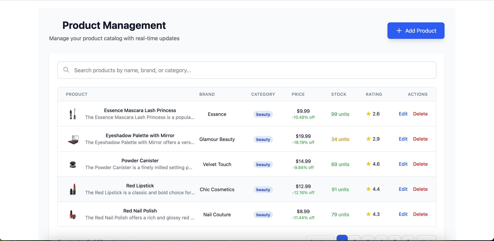
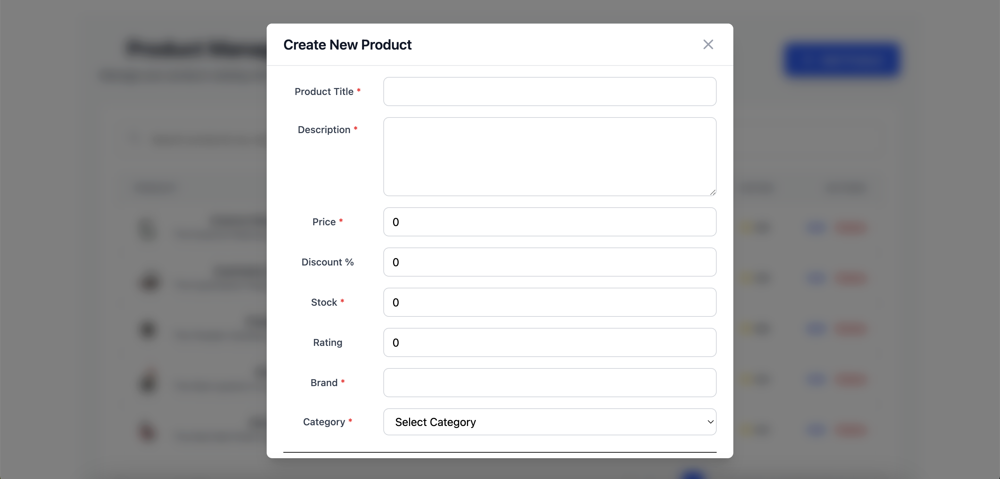

# Product Management CRUD Application

A modern, full-featured product management system built with React, TypeScript, and Tailwind CSS. This application provides a complete CRUD (Create, Read, Update, Delete) interface for managing product catalogs with real-time updates and an intuitive user experience.

## Live Demo

🚀 **[View Live Demo](https://crud-app-tl3e.vercel.app/)**


## Features

### Core Functionality
- **Complete CRUD Operations**: Create, read, update, and delete products seamlessly
- **Real-time Updates**: Optimistic UI updates for immediate feedback
- **Form Validation**: Comprehensive validation using Zod schema with React Hook Form
- **Search & Filter**: Search products by name, brand, or category in real-time
- **Pagination**: Efficient data display with 5 records per page
- **Responsive Design**: Fully responsive interface that works on all devices

### User Interface
- **Modern Design**: Clean and intuitive interface built with Tailwind CSS
- **Modal Forms**: Elegant modal dialogs for creating and editing products
- **Horizontal Form Layout**: Labels positioned on the left side for better readability
- **Smart Alerts**: Beautiful SweetAlert2 notifications for user feedback
- **Loading States**: Visual feedback during data operations
- **Error Handling**: Comprehensive error handling with user-friendly messages

### Product Management
- Product details including title, description, price, and discount
- Stock tracking with visual indicators (green/yellow/red based on quantity)
- Product ratings with star visualization
- Brand and category organization
- Product thumbnails and image support

## Screenshots

### Product List View


*Main dashboard showing product table with search functionality, pagination, and quick actions*

### Add/Edit Product Form


*Modal form with horizontal label layout for creating and editing products*

## Tech Stack

### Frontend
- **React 19.2.0** - Latest React with modern hooks and features
- **TypeScript 5.9.3** - Type-safe development
- **Vite (Rolldown)** - Lightning-fast build tool
- **Tailwind CSS 4.1.18** - Utility-first CSS framework

### Form Management
- **React Hook Form 7.69.0** - Performant form handling
- **Zod 4.3.4** - TypeScript-first schema validation
- **@hookform/resolvers** - Integration between RHF and Zod

### UI/UX
- **SweetAlert2 11.26.17** - Beautiful, responsive alerts and modals
- **Custom Components** - Reusable form components (Input, Select, TextArea)

### Development Tools
- **ESLint 9.39.1** - Code linting and quality
- **TypeScript ESLint** - TypeScript-specific linting rules
- **Vite Plugin React** - Fast refresh and JSX support

## Installation

### Prerequisites
- Node.js 18+
- npm or yarn package manager

### Setup Instructions

1. **Clone the repository**
   ```bash
   git clone <your-repository-url>
   cd crud-project
   ```

2. **Navigate to the app directory**
   ```bash
   cd crud-app
   ```

3. **Install dependencies**
   ```bash
   npm install
   # or
   yarn install
   ```

4. **Start the development server**
   ```bash
   npm run dev
   # or
   yarn dev
   ```

5. **Open your browser**
   ```
   Navigate to http://localhost:5173
   ```

## Usage

### Adding a Product
1. Click the "Add Product" button in the top-right corner
2. Fill in the product details in the modal form:
   - Product Title (required, min 3 characters)
   - Description (required, min 10 characters)
   - Price (required, must be greater than 0)
   - Discount Percentage (optional, 0-100%)
   - Stock (required, whole number)
   - Rating (optional, 0-5 stars)
   - Brand (required, min 2 characters)
   - Category (required, select from dropdown)
3. Click "Create Product" to save

### Editing a Product
1. Click the "Edit" button next to any product in the table
2. Modify the product details in the modal form
3. Click "Update Product" to save changes

### Deleting a Product
1. Click the "Delete" button next to any product
2. Confirm the deletion in the alert dialog
3. The product will be removed from the list

### Searching Products
- Use the search bar to filter products by name, brand, or category
- Results update in real-time as you type
- Pagination resets to page 1 when searching

### Navigating Pages
- Use the page number buttons to jump to specific pages
- Use "Previous" and "Next" buttons for sequential navigation
- Current page is highlighted in blue
- Shows 5 products per page

## Project Structure

```
crud-project/
├── crud-app/
│   ├── src/
│   │   ├── assets/              # Images and static assets
│   │   │   ├── image-1.png
│   │   │   ├── image-2.png
│   │   │   └── react.svg
│   │   ├── components/          # React components
│   │   │   ├── form/           # Form field components
│   │   │   │   ├── Input.tsx
│   │   │   │   ├── Select.tsx
│   │   │   │   └── TextArea.tsx
│   │   │   ├── Modal.tsx       # Modal wrapper component
│   │   │   ├── ProductForm.tsx # Product form with validation
│   │   │   └── ProductList.tsx # Product table with pagination
│   │   ├── services/           # API services
│   │   │   └── productService.ts
│   │   ├── types/              # TypeScript type definitions
│   │   │   └── product.ts
│   │   ├── App.tsx             # Main application component
│   │   ├── main.tsx            # Application entry point
│   │   └── App.css             # Global styles
│   ├── package.json            # Dependencies and scripts
│   ├── tsconfig.json           # TypeScript configuration
│   ├── vite.config.ts          # Vite configuration
│   └── tailwind.config.ts      # Tailwind configuration
└── README.md                   # This file
```

## Key Features Implementation

### Form Validation
The application uses Zod schema validation with the following rules:
- Title: 3-100 characters
- Description: Minimum 10 characters
- Price: Must be greater than 0
- Discount: 0-100%
- Rating: 0-5 stars
- Stock: Non-negative whole number
- Brand: Minimum 2 characters
- Category: Must be selected from available options

### Optimistic Updates
The application implements optimistic UI updates:
- Products appear immediately when created
- Changes reflect instantly when edited
- Smooth removal when deleted
- Rollback on error with user notification

### Responsive Design
- Mobile-friendly table with horizontal scrolling
- Responsive modal dialogs
- Touch-friendly buttons and controls
- Adaptive pagination controls

## API Integration

The application connects to the [DummyJSON API](https://dummyjson.com) for product data:
- `GET /products` - Fetch all products
- `GET /products/categories` - Fetch categories
- `POST /products/add` - Create new product
- `PUT /products/:id` - Update existing product
- `DELETE /products/:id` - Delete product

## Scripts

```bash
# Start development server
npm run dev

# Build for production
npm run build

# Preview production build
npm run preview

# Run ESLint
npm run lint
```

## Browser Support

- Chrome (latest)
- Firefox (latest)
- Safari (latest)
- Edge (latest)

## Contributing

Contributions are welcome! Please follow these steps:

1. Fork the repository
2. Create a feature branch (`git checkout -b feature/AmazingFeature`)
3. Commit your changes (`git commit -m 'Add some AmazingFeature'`)
4. Push to the branch (`git push origin feature/AmazingFeature`)
5. Open a Pull Request

## License

This project is open source and available under the [MIT License](LICENSE).

## Contact

For questions or feedback, please open an issue on GitHub.

---

**Built with** ❤️ **using React, TypeScript, and Tailwind CSS**
